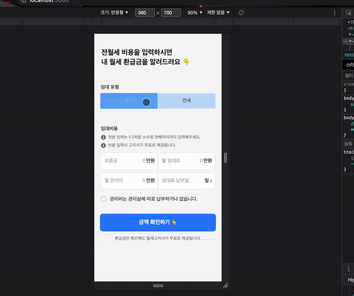

# **📋 프로젝트 개요**



해당 프로젝트는 콜버스랩 사전 과제를 위해 제작하였습니다.

- 전반적으로 ****presentational and container 패턴으로 비즈니스 로직과 렌더링을 위한 View Component 를 분리하는 방식으로 구현하였습니다.****

# 사용한 종속성 라이브러리

- react-cookie - 쿠키를 통한 자료 저장을 위해 설치하였으나, 중간부터 react-router-dom의 location.state를 이용하는 방식으로 수정하였습니다.
- react-datepicker - datepicker를 간편하게 사용할 수 있는 외부 라이브러리 입니다.
- react-daum-postcode - 다음의 주소 찾기를 간편하게 사용할 수 있는 외부 라이브러리 입니다.
- react-redux, redux - Client State를 관리하기 위해 사용한 라이브러리 입니다.
- styled-components - 전반적으로 CSS module을 사용하였지만 datepicker의 디자인을 커스텀 할 때 사용하였습니다.
- react-router-dom - 어플리케이션의 라우팅을 위해 사용하였습니다.
---
- Email : [seobisback@gmail.com](mailto:seobisback@gmail.com)
- Notion Portpolio : [Developer Seobwoo Kim Portpolio](https://www.notion.so/Developer-Seobwoo-Kim-Portpolio-a2d2e2fb6c6e4a4b9de09c47e99f3010)
- Github Link : [sdf5771 - Overview](https://github.com/sdf5771)
- Github Tech Blog : [Seobisback Github Blog](https://sdf5771.github.io/)

---

# 1. 설치 및 실행방법

- Node Package Manager를 통한 종속성 라이브러리 설치

```python
npm install
```

- React Script 실행

```python
npm start
```

- 서버 API Git Repo

https://github.com/sdf5771/zaritalk-clone-fe.git

---

# 2. 프로젝트 Directory 구조

- Path : src/

```html
.
├── App.tsx
├──📁 assets
│   └──📁 images
│       ├──📁 complete-refund
│       │   └── house_icon.svg
│       ├──📁 public
│       │   ├── arrow_right.svg
│       │   ├── arrow_right_gray.svg
│       │   ├── call_icon.svg
│       │   └── mail_icon.svg
│       ├──📁 refund
│       │   ├── alert_logo.svg
│       │   ├── check_box_active.svg
│       │   └── check_box_default.svg
│       └──📁 residence
│           └── reading_glasses_icon.svg
├──📁 components
│   ├──📁 complete-refund
│   │   ├──📁 refund-result
│   │   │   ├── RefundResultContainer.tsx
│   │   │   ├── RefundResultPresenter.module.css
│   │   │   ├── RefundResultPresenter.tsx
│   │   │   └── type
│   │   │       └── RefundResultType.ts
│   │   └──📁 title-decription
│   │       ├── TitleDescriptionContainer.tsx
│   │       ├── TitleDescriptionPresenter.module.css
│   │       ├── TitleDescriptionPresenter.tsx
│   │       └── type
│   │           └── TitleDescriptionType.ts
│   ├──📁 public
│   │   ├──📁 alert_description
│   │   │   ├── AlertDescriptionContainer.tsx
│   │   │   ├── AlertDescriptionPresenter.module.css
│   │   │   ├── AlertDescriptionPresenter.tsx
│   │   │   └── type
│   │   │       └── AlertDescriptionType.ts
│   │   ├──📁 blue-type-btn
│   │   │   ├── BlueTypeBtn.module.css
│   │   │   └── BlueTypeBtn.tsx
│   │   ├──📁 icon-text-button
│   │   │   ├── IconTextButtonContainer.tsx
│   │   │   ├── IconTextButtonPresenter.module.css
│   │   │   ├── IconTextButtonPresenter.tsx
│   │   │   └── type
│   │   │       └── IconTextButtonType.ts
│   │   ├──📁 left-input-box
│   │   │   ├── LeftInputBoxContainer.tsx
│   │   │   ├── LeftInputBoxPresenter.module.css
│   │   │   ├── LeftInputBoxPresenter.tsx
│   │   │   └── type
│   │   │       └── LeftInputBoxType.ts
│   │   ├──📁 public-toast-message
│   │   │   ├── PublicToastMessageContainer.tsx
│   │   │   ├── PublicToastMessagePresenter.module.css
│   │   │   └── PublicToastMessagePresenter.tsx
│   │   └──📁 text-input-box
│   │       ├── TextInputBoxContainer.tsx
│   │       ├── TextInputBoxPresenter.module.css
│   │       ├── TextInputBoxPresenter.tsx
│   │       ├── TextInputTitleBoxPresenter.module.css
│   │       ├── TextInputTitleBoxPresenter.tsx
│   │       └── type
│   │           └── TextInputBoxType.ts
│   ├──📁 refund
│   │   └── toggle-btn
│   │       ├── ToggleBtnContainer.tsx
│   │       ├── ToggleBtnPresenter.module.css
│   │       └── ToggleBtnPresenter.tsx
│   └──📁 residence
│       ├──📁  addressInput
│       │   ├── AddressInputContainer.tsx
│       │   ├── AddressInputPresenter.module.css
│       │   ├── AddressInputPresenter.tsx
│       │   └── type
│       │       └── AddressInputType.ts
│       ├──📁 phoneNumberInput
│       │   ├── PhoneNumberInputContainer.tsx
│       │   ├── PhoneNumberInputPresenter.module.css
│       │   ├── PhoneNumberInputPresenter.tsx
│       │   └── type
│       │       └── PhoneNumberInputType.ts
│       └──📁 refund-esmimation-display
│           ├── RefundEstimationDisplayContainer.tsx
│           ├── RefundEstimationDisplayPresenter.module.css
│           ├── RefundEstimationDisplayPresenter.tsx
│           └── type
│               └── RefundEstimationDisplayType.ts
├── index.tsx
├──📁 modules
│   ├── calculateRentRefund.ts
│   └── refValueReturn.ts
├──📁 reducers
│   ├── reducers.ts
│   └──📁 routes
│       ├──📁 refund
│       │   ├── locationRentTypeReducer.ts
│       │   └── rentalTypeToggleClickReducer.ts
│       └──📁 residence
│           └── addressValueReducer.ts
├──📁 routes
│   ├──📁 complete-refund
│   │   ├── CompleteRefundView.module.css
│   │   └── CompleteRefundView.tsx
│   ├──📁 refund
│   │   ├── RefundView.module.css
│   │   └── RefundView.tsx
│   └──📁 residence
│       ├── ResidenceView.module.css
│       └── ResidenceView.tsx
└──📁 store
    └── store.ts
```

- components : 공용으로 사용하는 component는 ‘public’ 폴더에 두고, 그 밖의 Components는 각자 성격에 맞는 폴더에 저장
- images : 이미지 리소스를 담은 폴더
- modules : 환급금을 계산하는 함수와 입력 값을 검사하는 함수를 담은 폴더
- reducers : 리듀서를 모아둔 폴더
- route : 라우팅된 path 별로 정리해둔 폴더
- store : store를 담은 폴더

---
